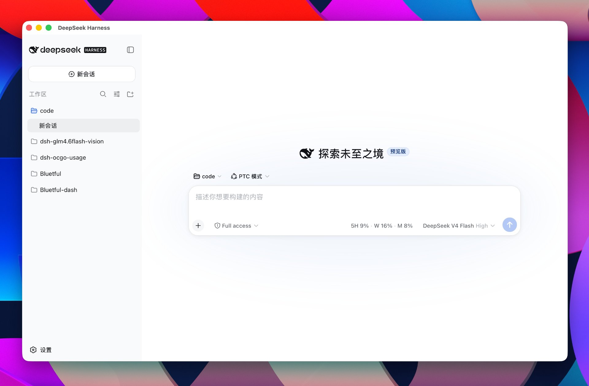
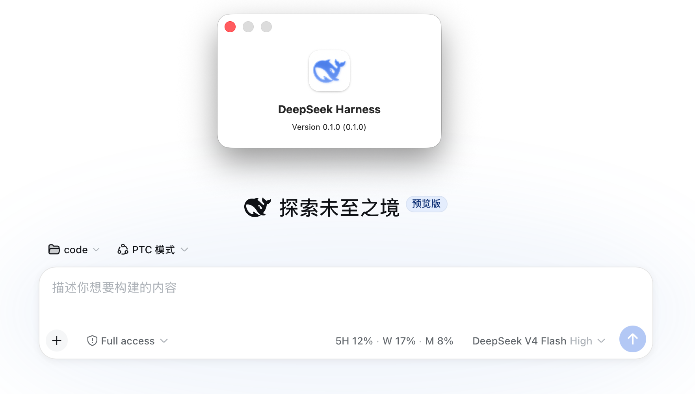

# DeepSeek Harness — macOS Desktop Shell

> 基于 Tauri 2 的 DeepSeek Harness macOS 桌面版，当前主要面向 Intel（x86_64）Mac。

[English](README_EN.md) 这是一个围绕 [DeepSeek Harness](https://github.com/deepseek-ai/deepseek-harness) 构建的 macOS 桌面壳。

项目不修改 DeepSeek Harness 的核心架构，也不重新实现 Web 应用，而是将现有的 `dsh web` 运行时、Node.js Runtime 与 Tauri 2 桌面应用组合在一起。

启动桌面应用后，由 Tauri / Rust 负责启动本地 `dsh web` 服务，再通过 Tauri WebView 加载本地 Web UI，从而让 DeepSeek Harness 以 macOS `.app` 的形式运行。

> 本项目为非官方的独立桌面发行方案，目前主要用于验证和探索 macOS 原生桌面分发方式。

## 界面预览

### DeepSeek Harness Desktop Interface



### About Window



## 下载

最新版本：**v0.1.2**

内置 DeepSeek Harness：`dsh-v0.1.2-alpha.2`

[GitHub Releases](https://github.com/Suxinljh/dsh-macOS-intel/releases)

当前版本提供 Intel / x86_64 macOS 构建，包含两种产物：

- `DeepSeek.Harness.Intel-<version>_x64.dmg`：桌面应用，双击后将 `.app` 拖入 `Applications` 即可。
- `dsh-<version>-macos-x64.pkg`：命令行安装包，把 Harness 与捆绑的 Node Runtime 安装到 `/usr/local/dsh`，并在 `/usr/local/bin/dsh` 暴露 `dsh` 命令。

## 工作方式

整个桌面应用本质上是对现有 Harness Web Runtime 的原生封装。

```text
DeepSeek Harness.app
│
├── Tauri 2 / Rust
│
├── Node.js Runtime
│
└── DeepSeek Harness Runtime
    ├── dsh web
    ├── apps/web/dist
    └── Runtime Dependencies
```

启动流程：

```text
Tauri Desktop App
       │
       ▼
启动内置 Node.js
       │
       ▼
dsh web --host 127.0.0.1 --port 0 --no-open
       │
       ▼
本地 HTTP Server
       │
       ▼
Tauri WebView
       │
       ▼
http://127.0.0.1:<port>
```

桌面版默认使用 `port 0`，由操作系统自动分配可用端口，因此不会固定占用 `3080`，也可以避免与其他本地服务发生端口冲突。

本地服务仅监听 `127.0.0.1`，不会直接暴露到局域网。

## 项目结构

```text
dsh-macOS-intel/
│
├── docs/
│   └── images/
│       ├── desktop-overview.jpg
│       └── about-window.png
│
├── scripts/
│   ├── build-tauri-macos.sh
│   ├── gen-icon.py
│   └── build-dmg.sh
│
├── src-tauri/
│   ├── src/
│   │   ├── lib.rs
│   │   └── main.rs
│   │
│   ├── icons/
│   │   ├── icon.icns
│   │   └── icon.png
│   │
│   ├── capabilities/
│   │   └── default.json
│   │
│   ├── gen/
│   │   └── schemas/
│   │
│   ├── Cargo.toml
│   ├── Cargo.lock
│   ├── build.rs
│   └── tauri.conf.json
│
├── ui-stub/
│   └── index.html
│
├── package.json
├── package-lock.json
├── package-macos-x64.sh
├── .gitignore
└── README.md
```

各目录主要用途：

- `src-tauri/`：Tauri 2 桌面应用及 Rust 启动器。
- `src-tauri/src/`：负责启动和管理本地 Harness Server，以及创建 WebView。
- `src-tauri/icons/`：macOS 应用图标。
- `scripts/`：构建、打包和资源处理脚本。
- `scripts/build-dmg.sh`：用 dmgbuild 生成带背景图与图标布局的 DMG（直接写入 .DS_Store，无需 Finder 自动化）。
- `docs/images/`：README 使用的项目截图。
- `ui-stub/`：Tauri WebView 的基础入口。
- `package.json`：Tauri CLI 和项目构建依赖。

官方 DeepSeek Harness 源代码不会直接放在这个仓库中。

构建时，通过 `CORE_REPO` 指向本地的官方 Harness 源码目录，由构建脚本读取需要的 Runtime 和前端构建产物。

## 与 DeepSeek Harness 的关系

本项目定位为一个独立的 macOS Desktop Distribution Layer。

```text
官方 DeepSeek Harness
        │
        │ dsh web
        ▼
Harness Web Runtime
        │
        ▼
Tauri 2 Desktop Shell
        │
        ▼
DeepSeek Harness.app
```

桌面壳主要负责：

- macOS `.app` 封装
- Tauri 生命周期管理
- Node.js Runtime 管理
- `dsh web` 启动与退出
- 本地端口管理
- WebView 加载
- macOS 应用资源
- 构建和打包流程

Harness 本身的 Web UI、API 和核心运行逻辑仍然由官方项目提供。

## 构建要求

当前主要针对：

- macOS
- Intel / x86_64
- Node.js 22
- Rust
- Xcode Command Line Tools
- 官方 DeepSeek Harness 本地源码

安装 Xcode Command Line Tools：

```bash
xcode-select --install
```

安装 Rust：

[https://rustup.rs](https://rustup.rs/)

Node.js 仅用于构建和打包。

生成 `.app` 后，应用运行时使用的是随应用一起打包的 Node.js Runtime，用户不需要另外安装 Node.js。

## 构建

首先安装项目依赖：

```bash
npm install
```

然后执行：

```bash
bash scripts/build-tauri-macos.sh
```

如果官方 Harness 源码不在默认路径，可以手动指定：

```bash
CORE_REPO=/path/to/deepseek-harness \
bash scripts/build-tauri-macos.sh
```

### 重新构建 Harness

如果希望在打包前重新安装依赖并构建官方 Harness：

```bash
bash scripts/build-tauri-macos.sh --rebuild
```

### 精简 Runtime

可以使用：

```bash
bash scripts/build-tauri-macos.sh --trim
```

该模式会删除部分开发阶段不需要的文件和目录，以减小最终应用体积。

### Debug 构建

```bash
bash scripts/build-tauri-macos.sh --debug
```

Release `.app` 默认生成在：

```text
src-tauri/target/x86_64-apple-darwin/release/bundle/macos/
```

### 构建 DMG（带背景图与图标布局）

先安装 dmgbuild：

```bash
pip3 install dmgbuild
```

再执行：

```bash
bash scripts/build-dmg.sh
```

脚本会基于已构建的 `.app` 生成 `dist/DeepSeek.Harness.Intel-<version>_x64.dmg`。
DMG 的背景图与图标布局通过 dmgbuild 直接写入 `.DS_Store`，不依赖 Finder 自动化，结果可复现。

## 运行

构建完成后直接打开：

```text
DeepSeek Harness.app
```

应用启动后会自动：

1. 定位内置 Node.js Runtime。
2. 定位打包后的 Harness Runtime。
3. 启动 `dsh web`。
4. 使用系统自动分配的本地端口。
5. 等待 Web Server 启动完成。
6. 创建 Tauri WebView。
7. 加载本地 Harness UI。
8. 应用退出时关闭对应的 Node.js Server。

因此用户不需要手动执行：

```bash
dsh web
```

也不需要另外打开浏览器。

## Runtime 数据

打包过程不会将开发环境中的个人 Harness 数据复制到 `.app` 内。

以下内容不会被主动打包：

- 本地会话记录
- Credentials
- Plugin Cache
- 用户 Profile
- `~/.dsh` 数据
- 开发环境配置

当前桌面版启动 Harness Runtime 时会继承用户的 `HOME` 环境变量。

因此，具体 Runtime 行为仍然取决于当前 DeepSeek Harness 的数据存储机制。已有的 `~/.dsh` 数据可能会被当前 Harness Runtime 使用。

运行日志位于：

```text
~/.dsh/logs/
```

例如：

```text
~/.dsh/logs/dsh-server-stdout.log
~/.dsh/logs/dsh-server-stderr.log
~/.dsh/logs/dsh-server-desktop.log
```

后续可以考虑将桌面版数据迁移到独立的 macOS Application Support 目录，以进一步隔离 CLI 与 Desktop 数据。

## Runtime 打包

最终 `.app` 主要包含三个部分：

```text
DeepSeek Harness.app
│
├── Tauri Desktop Application
│
├── Node.js Runtime
│
└── Harness Runtime
    ├── CLI Runtime
    ├── Web Frontend
    └── Required Dependencies
```

Harness Runtime 会在构建过程中从官方 Harness 本地源码生成。

为了避免将大量生成文件提交到 Git，以下资源属于构建过程中的临时文件：

```text
src-tauri/resources/app.tar.gz
src-tauri/resources/runtime/
```

这些目录已经加入 `.gitignore`。

## Intel 支持

当前版本主要针对 Intel Mac：

```text
x86_64-apple-darwin
```

Apple Silicon Mac 理论上可以通过 Rosetta 运行 Intel 版本，但当前项目并未以 Apple Silicon 为主要构建目标。

后续可以根据实际需求增加：

```text
Intel
x86_64

Apple Silicon
arm64

Universal
x86_64 + arm64
```

## 当前状态

目前这是一个独立的 macOS Desktop Shell 实现。

当前重点是验证：

- Tauri 2 是否适合作为 Harness 的 macOS 桌面容器；
- `dsh web` 是否适合直接作为桌面版本地 Runtime；
- 内置 Node.js Runtime 的方式是否适合作为独立发行方案；
- Intel macOS 是否值得作为单独发行版本维护；
- Desktop 与 CLI Runtime 的数据目录应该如何隔离。

项目本身尽量保持独立，不修改 DeepSeek Harness 的核心代码。

## 关于官方项目

这个项目的目标不是创建一个独立的 Harness 分支，而是探索一种额外的 macOS 分发方式。

如果这种方案符合官方项目的方向，可以进一步根据维护者的意见：

- 调整项目结构；
- 移入官方仓库；
- 作为独立 Desktop Package 维护；
- 增加 Apple Silicon / Universal Build；
- 根据官方 Runtime 结构调整打包逻辑。

欢迎 DeepSeek Harness Maintainers 对项目结构和 Desktop Distribution 方案提出意见。

## 更新记录

### v0.1.2

- 对齐 DeepSeek Harness 官方版本 `dsh-v0.1.2-alpha.2`，桌面壳版本由 `0.1.1` 调整为 `0.1.2`。
- 适配新版浏览器会话鉴权：`dsh web` 输出的就绪地址现在带 `?token=...`，服务端只接受携带该 token 或已换取 Cookie 的请求。桌面壳改为解析完整的就绪 URL，并让 WebView 加载带 token 的地址——沿用旧的裸地址会在首次请求时被拒绝。
- 就绪等待超时由 30 秒放宽到 60 秒：新版只有在 profile 的 Loader 树就绪后才打印就绪行，首次启动还需要初始化 `~/.dsh/profiles`。
- 修正 `scripts/build-tauri-macos.sh` 中 `CORE_REPO` 的默认路径。原默认值指向仓库外的路径，未显式传参时会直接构建失败。
- 新增命令行安装包产物 `dsh-<version>-macos-x64.pkg`。

> 已知问题：若 `dsh` 进程被强制退出，`~/.dsh/profiles/node_modules.lock` 可能残留，导致下次启动在等待写锁时超时。删除该 `.lock` 文件即可恢复。

### v0.1.1

- 对齐 DeepSeek Harness 官方仓库版本号（`dsh-v0.1.1-rc.2`），桌面壳版本由 `0.2.0` 调整为 `0.1.1`。
- 修复桌面端启动时会额外打开系统默认浏览器的问题：新版 harness 的 `dsh web` 默认会主动打开浏览器，桌面壳现已在启动参数中加入 `--no-open`，UI 统一由 Tauri WebView 承载，不再弹出外部浏览器。

### v0.2.0

- 改进 DMG 图标布局与背景图，改用 `dmgbuild` 程序化写入 `.DS_Store`，结果可复现。

### v0.1.0

- 首个可运行版本：Tauri 2 桌面壳 + 内置 Node.js Runtime + DeepSeek Harness Runtime，UI 由 Tauri WebView 承载。

## 声明

本项目是基于 DeepSeek Harness 的独立第三方 macOS Desktop Shell。

**本项目不是官方 DeepSeek 产品，也不代表 DeepSeek 官方立场。**

DeepSeek Harness 官方项目：

https://github.com/deepseek-ai/deepseek-harness
